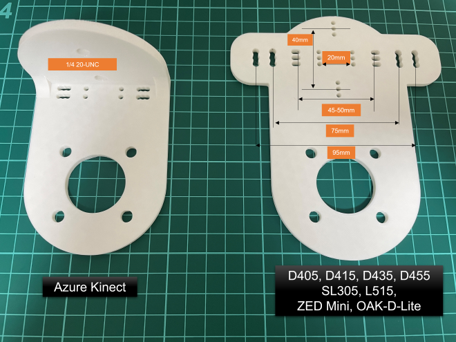
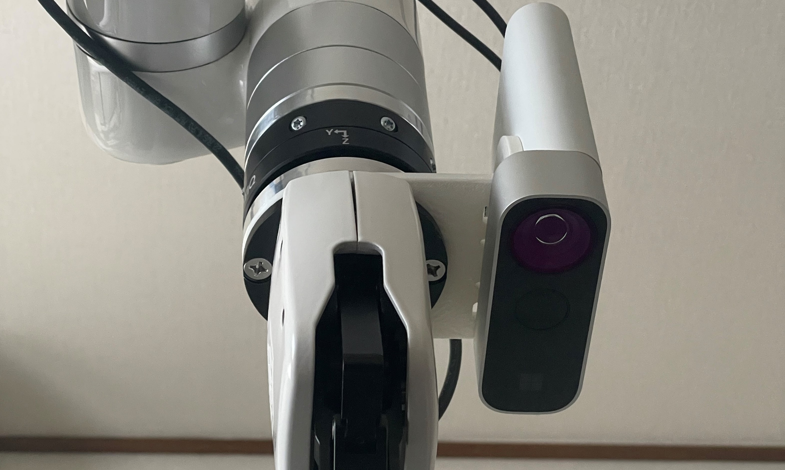
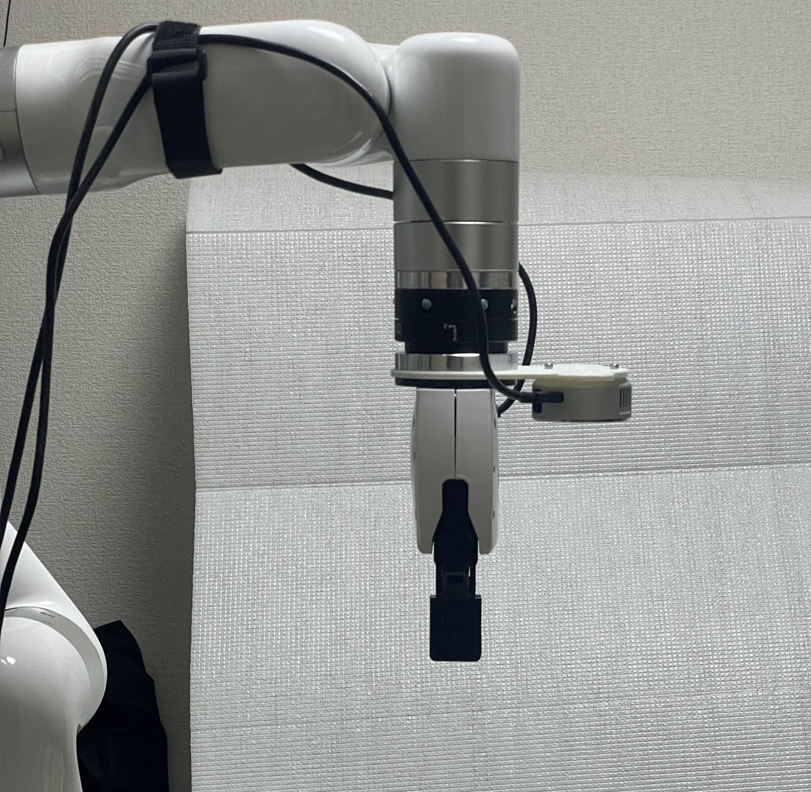

# DepthCameraMount
Depth camera mount for xArm, Lite 6, UR series etc used in:
- https://youtu.be/2pLCcNeoXsU?si=wv-QqfqyQgH3g9Pk 
- https://youtu.be/nWx8Ilmcf1s?si=H3oGqbb0otGvivVJ
- https://youtu.be/tqb_0xAqm3w?si=GDawZZg4jw47NYZ6

 

## File
- [D405_415_435_455_L515_SR305_oakd_oakdlite_mount.stl](/D405_415_435_455_L515_SR305_oakd_oakdlite_mount.stl)
- [azurekinect_adapter4.stl](/azurekinect_adapter4.stl)
